# <h1 align="center">《Athena-Mall-Front项目》</h1>

# 一、Athena-Mall-Front简介

Athena-Mall-Front项目为在线电商Web App (SPA)，项目包括首页, 搜索列表, 商品详情, 购物车, 订单, 支付, 用户登陆/注册等多个子模块，
使用Vue全家桶+ES6+Webpack+Axios等前端最新最热的技术，采用模块化、组件化、工程化的模式开发。
该项目能够帮助你快速的学习vue的相关技术，同时让你熟悉和了解大型项目的开发流程与设计，同时让你学习前端项目的技术选型与功能需求分析设计。

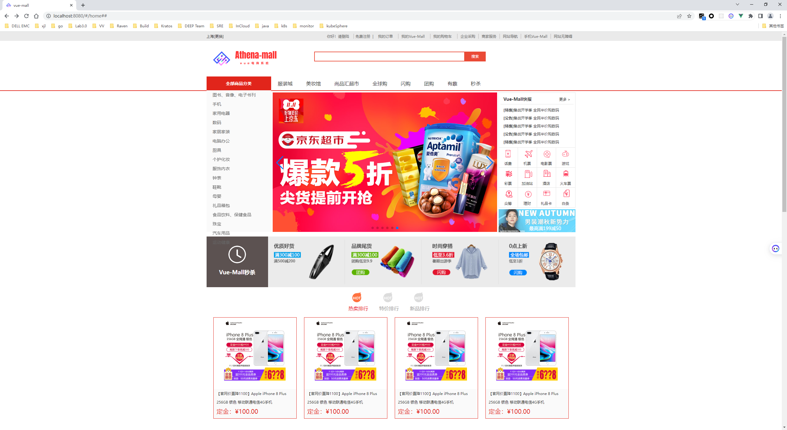

# 二、Athena-Mall-Front前序准备

## 2.1 Athena-Mall-Front项目简介

你需要在本地安装 node 和 git。本项目技术栈基于 ES2015+、vue、vuex、vue-router 、vue-cli 、axios 和 element-ui，
所有的请求数据都使用Mock.js进行模拟，提前了解和学习这些知识会对使用本项目有很大的帮助。
同时配套一个系列的教程文章，如何从零构建一个完整的前端项目，建议大家先看完这些文章再来实践本项目。

## 2.2 Vue知识体系

1. Vue Router 是 vue 官方的路由。它能快速的帮助你构建一个单页面或者多页面的项目。
2. Vuex 是一个专为 Vue.js 应用程序开发的状态管理模式。它采用集中式存储管理应用的所有组件的状态，并以相应的规则保证状态以一种可预测的方式发生变化。它能解决你很多全局状态或者组件之间通信的问题。
3. Vue Loader 是为 vue 文件定制的一个 webpack 的 loader，它允许你以一种名为单文件组件 (SFCs)的格式撰写 Vue 组件。它能在开发过程中使用热重载来保持状态，为每个组件模拟出 scoped CSS 等等功能。不过大部分情况下你不需要对它直接进行配置，脚手架都帮你封装好了。
4. Vue Test Utils 是官方提供的一个单元测试工具。它能让你更方便的写单元测试。
5. Vue Dev-Tools Vue 在浏览器下的调试工具。写 vue 必备的一个浏览器插件，能大大的提高你调试的效率。
6. Vue CLI 是官方提供的一个 vue 项目脚手架，本项目也是基于它进行构建的。它帮你封装了大量的 webpack、babel 等其它配置，让你能花更少的精力在搭建环境上，从而能更专注于页面代码的编写。不过所有的脚手架都是针对大部分情况的，所以一些特殊的需求还是需要自己进行配置。建议先阅读一遍它的文档，对一些配置有一些基本的了解。
7. Vetur 是 VS Code 的插件. 如果你使用 VS Code 来写 vue 的话，这个插件是必不可少的。

# 三、Athena-Mall-Front目录结构

```html
├──Athena-Mall-Front(整个项目名称)
|──────node_modules(项目依赖文件夹)
|──────public(一般放置一些静态资源(图片)，需要注意，放在public文件夹中的静态资源，webpack进行打包的时候，会原封不动打包到dist文件夹中)
|──────src(项目源代码)
|──────────api(项目api接口源码,按照不同的api分类存放)
|──────────assets(一般也是放置静态资源(一般放置多个组件共用的静态资源），需要注意，放置在assets文件夹里面静态资源，在webpack打包的时候，webpack会把静态资源当做一个模块，打包JS文件里面。)
|──────────components(一般放置的是非路由组件[全局组件])
|──────────mock(模拟后端返回的数据，按照不同的mock service分类存放)
|──────────pages/views(项目非公共组件)
|──────────plugins(项目插件)
|──────────router(项目路由)
|──────────store(vuex数据仓库)
|──────────App.vue(项目页面入口文件)
|──────────main.js(项目入口文件)
|──────Athena-Mall-Front-resources(项目总结笔记文件)
|──────────images(项目功能截图)
|──────────Athena-Mall-Front-API接口(项目接口文件)
|──────────Athena-Mall-Front的部署与访问(项目部署与访问文件)
|──────────Athena-Mall-Front面试问题(面试问题)
|──────────Athena-Mall-Front项目架构设计与技术选型(项目架构设计与技术选型)
|──────babel.config.js(ES6转ES5的文件)
|──────jsconfig.json(项目的名称缩写文件)
|──────package.json(项目的依赖版本管理文件)
|──────vue.config.js(vue的配置文件)
```

# 四、Athena-Mall-Front安装与运行以及部署

## 4.1 Athena-Mall-Front本地开发

### 克隆项目
```shell
git clone https://github.com/PanJiaChen/vue-element-admin.git
```

### 进入项目目录
```shell
cd vue-element-admin
```

### 安装依赖(国内用户)
```shell
npm install --registry=https://registry.npmmirror.com
```

### 本地启动
```shell
npm run serve
```

### 项目构建
```shell
npm run build
```

> 建议：
> 强烈建议不要用直接使用 cnpm 安装，会有各种诡异的 bug，可以通过重新指定 registry 来解决 npm 安装速度慢的问题。
> 若还是不行，可使用 yarn 替代 npm。Windows 用户若安装不成功，很大概率是node-sass安装失败，解决方案。
> 另外因为 node-sass 是依赖 python环境的，如果你之前没有安装和配置过的话，需要自行查看一下相关安装教程。

## 4.2 Athena-Mall-Front项目生产部署

### 安装Docker

```shell
# 使用国内 daocloud 一键安装命令：
sudo curl -sSL https://get.daocloud.io/docker | sh
sudo groupadd docker #添加docker用户组
sudo gpasswd -a $USER docker #将登陆用户加入到docker用户组中
newgrp docker #更新用户组
```

```shell
# 安装docker
curl -fsSL https://get.docker.com | bash -s docker --mirror Aliyun
# 启动docker服务
systemctl start docker
# 设置docker开机自启
systemctl enable docker
# 配置docker加速器
mkdir -p /etc/docker
tee /etc/docker/daemon.json <<-'EOF'
{
  "log-driver": "json-file",
  "log-opts": {
    "max-size": "10m",
    "max-file": "3"
  }
}
EOF
# 重启docker服务
systemctl daemon-reload
systemctl restart docker
echo "Docker安装完成！"
```

### Dockerfile

```dockerfile
FROM node:14
COPY ./ /app
WORKDIR /app
RUN npm install && npm run build

FROM nginx
RUN mkdir /app
COPY --from=0 /app/dist /app
COPY nginx/nginx.conf /etc/nginx/nginx.conf
```

### .dockerignore

```text
**/node_modules
**/dist
```

### nginx.conf

```text
user  nginx;
worker_processes  1;

error_log  /var/log/nginx/error.log warn;
pid        /var/run/nginx.pid;

events {
  worker_connections  1024;
}

http {
  include       /etc/nginx/mime.types;
  default_type  application/octet-stream;
  log_format  main  '$remote_addr - $remote_user [$time_local] "$request" '
                    '$status $body_bytes_sent "$http_referer" '
                    '"$http_user_agent" "$http_x_forwarded_for"';
  access_log  /var/log/nginx/access.log  main;
  sendfile        on;
  keepalive_timeout  65;
  server {
    listen       80;
    server_name  localhost;
    location / {
      root   /app;
      index  index.html;
      try_files $uri $uri/ /index.html;
    }
    error_page   500 502 503 504  /50x.html;
    location = /50x.html {
      root   /usr/share/nginx/html;
    }
    # 配置代理，解决跨域问题
    location /api {
    	proxy_pass http://sph-h5-api.atguigu.cn/api;
    }
  }
}
```

### build images

```shell
docker build . -t Athena-Mall-Front:1.0.0
$ docker login --username=18279148786 registry.cn-hangzhou.aliyuncs.com
$ docker tag [ImageId] registry.cn-hangzhou.aliyuncs.com/athena-zhuangxiaoyan/athena-mall-front:[镜像版本号]
$ docker push registry.cn-hangzhou.aliyuncs.com/athena-zhuangxiaoyan/athena-mall-front:[镜像版本号]
```

### pull images
```shell
docker pull registry.cn-hangzhou.aliyuncs.com/athena-zhuangxiaoyan/athena-mall-front:[镜像版本号]
```


### run container

```shell
docker run --privileged=true --restart=always -nname==Athena-Mall-Front -d -p 80:80  Athena-Mall-Front:1.0.0 
```

### https ip

```shell
http://remote-ip/
```


# 五、Athena-Mall-Front项目功能

##  5.1 home首页

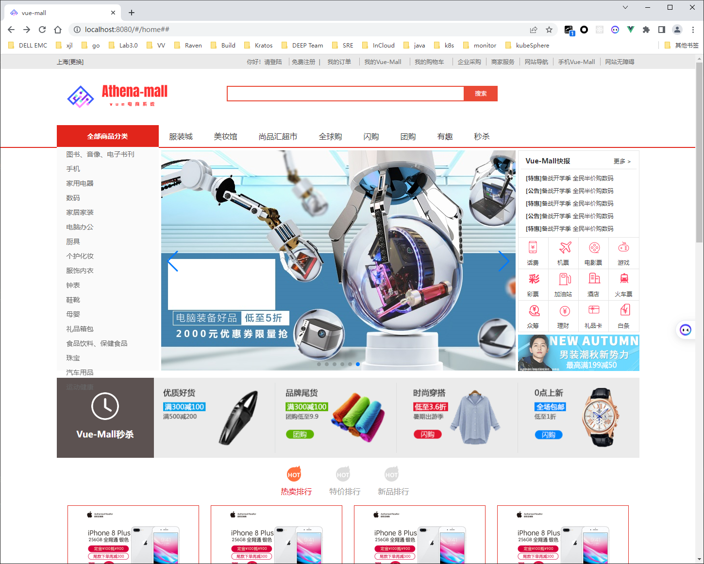

## 5.2 搜索页面

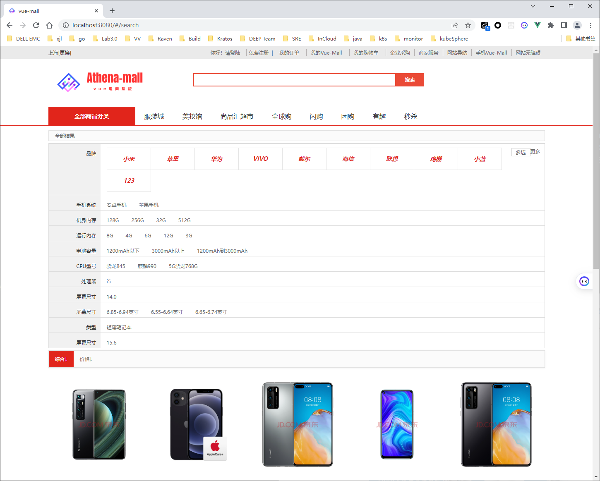

## 5.3 商品的详情页面

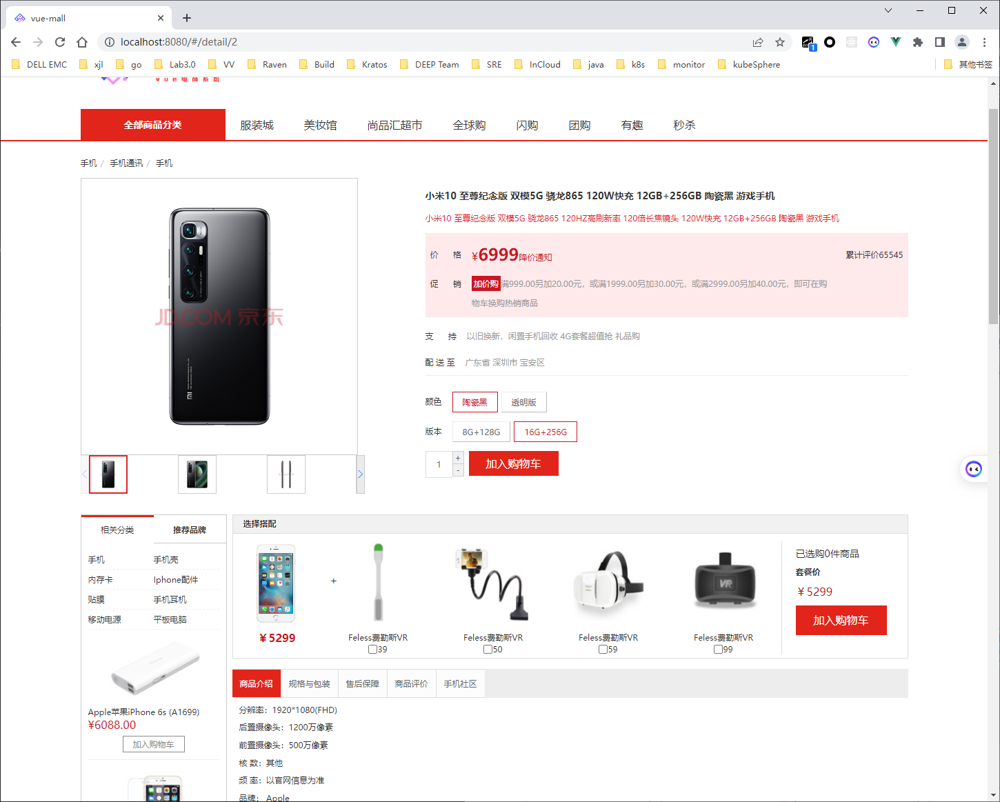

## 5.4 商品添加成功

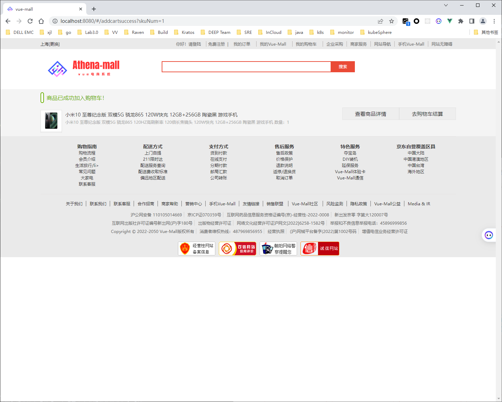

## 5.5 购车车页面

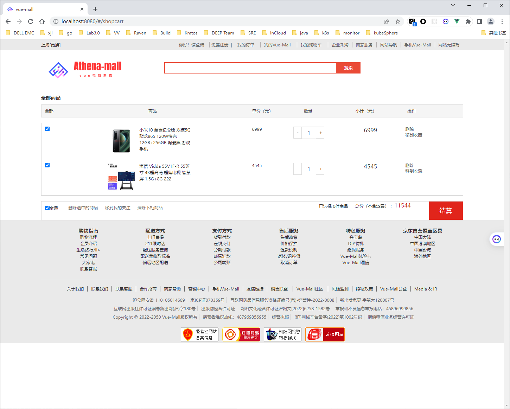

## 5.6 用户注册页面

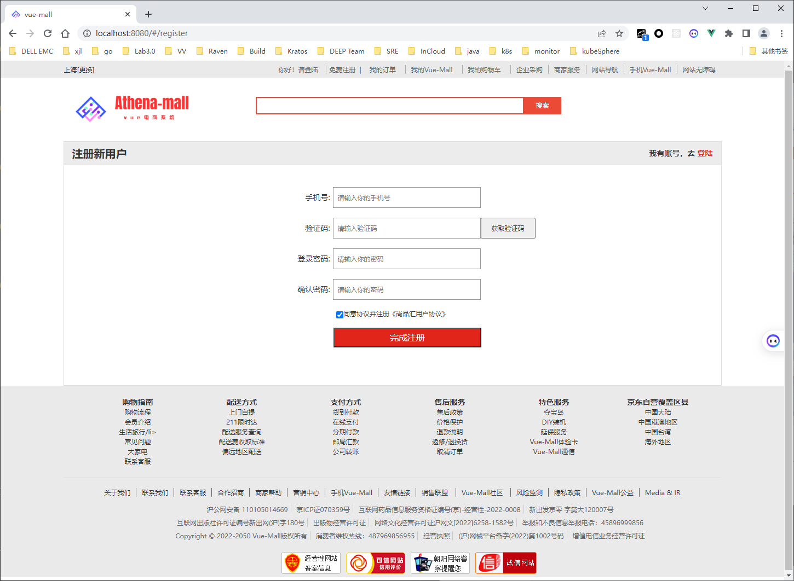

## 5.7 用户登陆页面

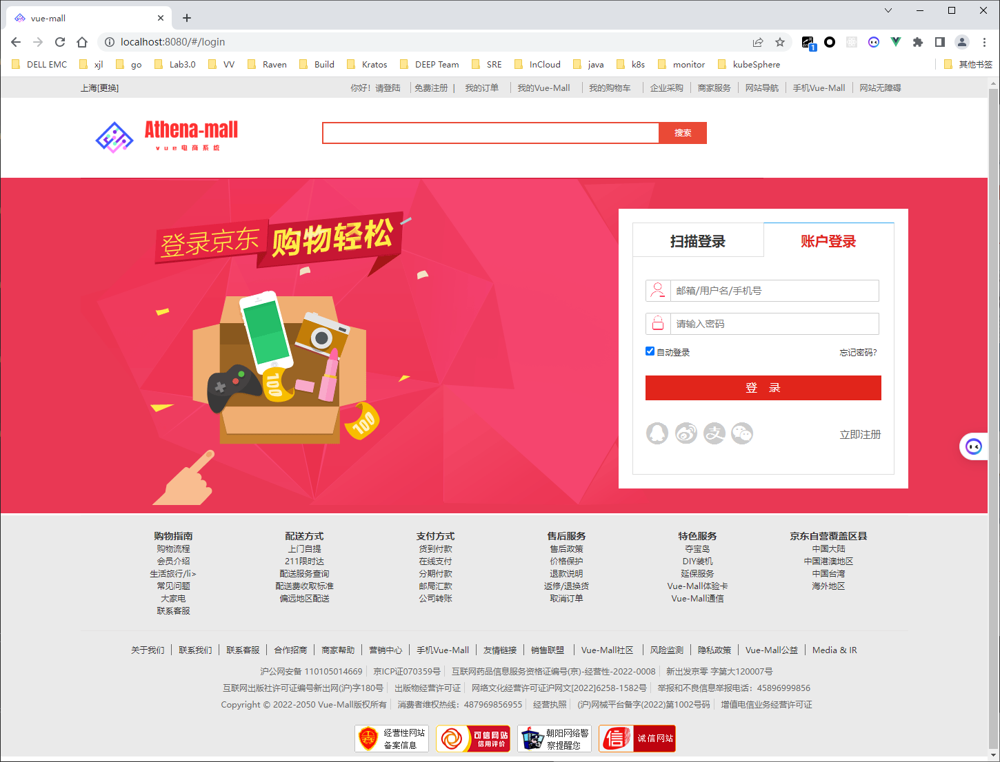

## 5.8 订单结算页面

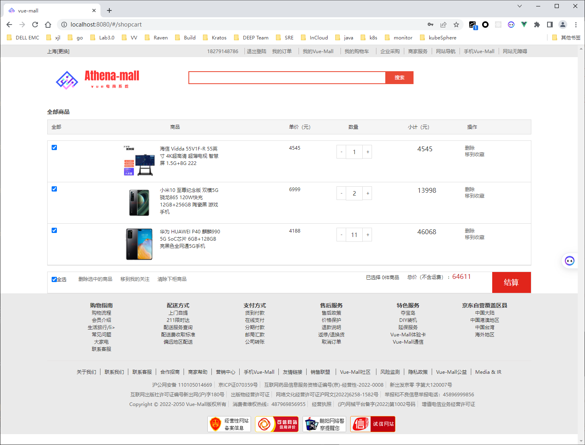

## 5.9 订单提交页面

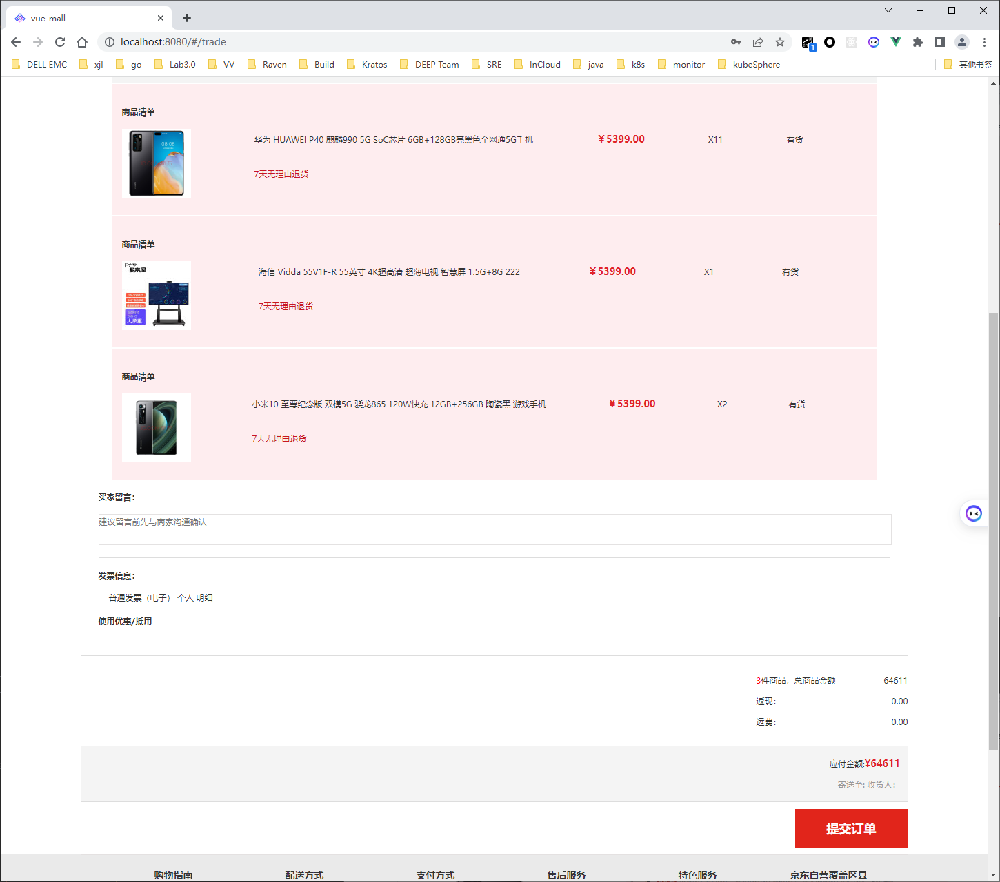

## 5.10 支付页面

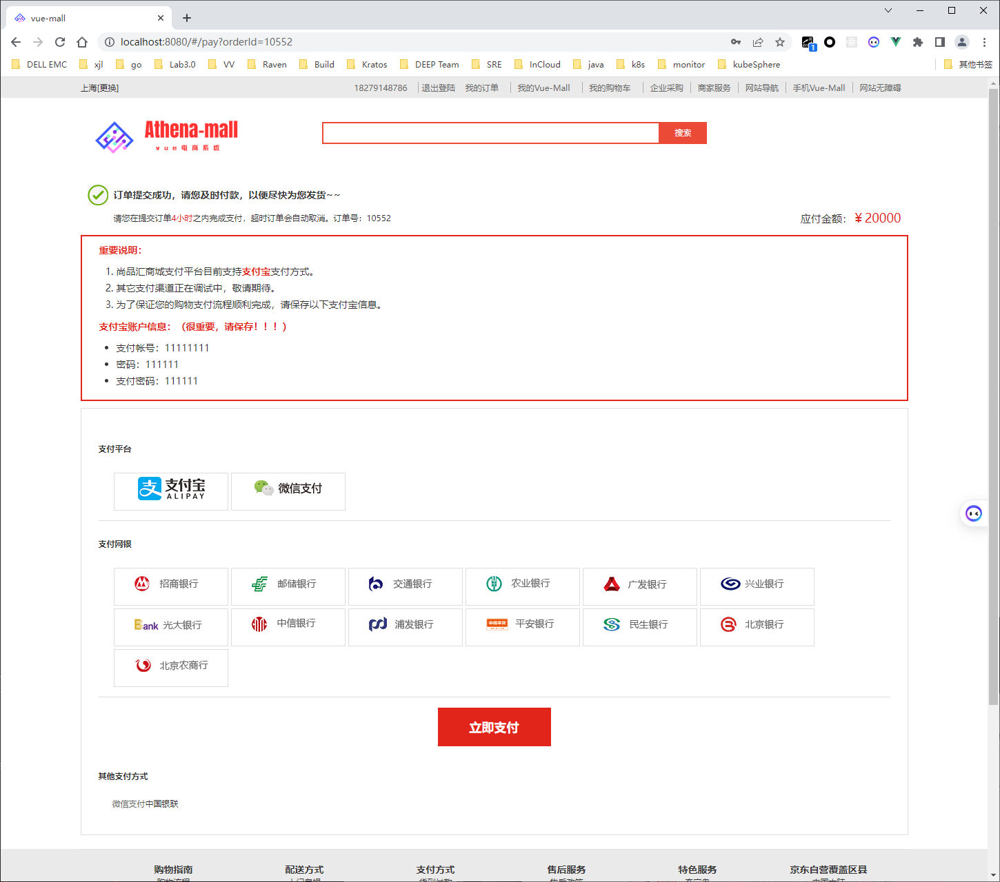

## 5.11 个人中心页面

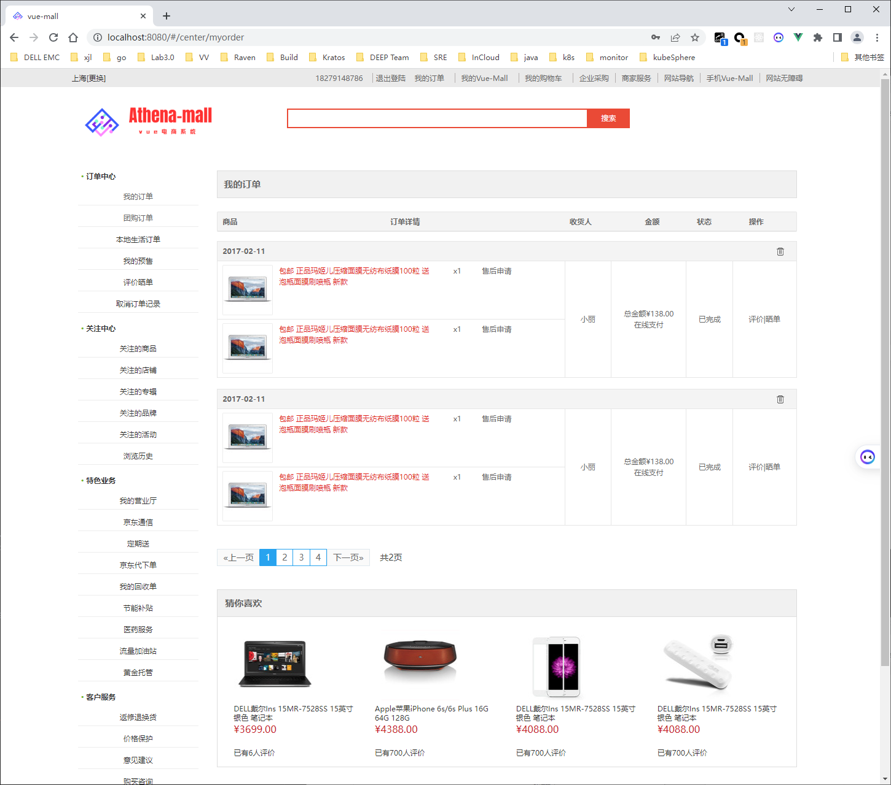

# 六、Contribution

本文档项目地址 Athena-Mall-Front 基于 vuepress开发。有任何修改和建议都可以该项目 pr 和 issue
Athena-Mall-Front还在持续迭代中，逐步沉淀和总结出更多功能和相应的实现代码，本项目也十分期待你的参与和反馈。

# 七、捐赠

如果你觉得这个项目帮助到了你，你可以帮作者买一杯果汁表示鼓励 ❤️ Donate

# 八、浏览器支持版本

| [](http://godban.github.io/browsers-support-badges/)</br>IE / Edge | [](http://godban.github.io/browsers-support-badges/)</br>Firefox | [](http://godban.github.io/browsers-support-badges/)</br>Chrome | [](http://godban.github.io/browsers-support-badges/)</br>Safari |
| --------- | --------- | --------- | --------- |
| IE10, IE11, Edge| last 2 versions| last 2 versions| last 2 versions

 	 		
# 九、项目参考
- [vue参考资料](https://github.com/wearetheone777/shangpinhuishop)
- [vue-element-admin-文档](https://panjiachen.gitee.io/vue-element-admin-site/zh/guide/#%E7%9B%AE%E5%BD%95%E7%BB%93%E6%9E%84)


