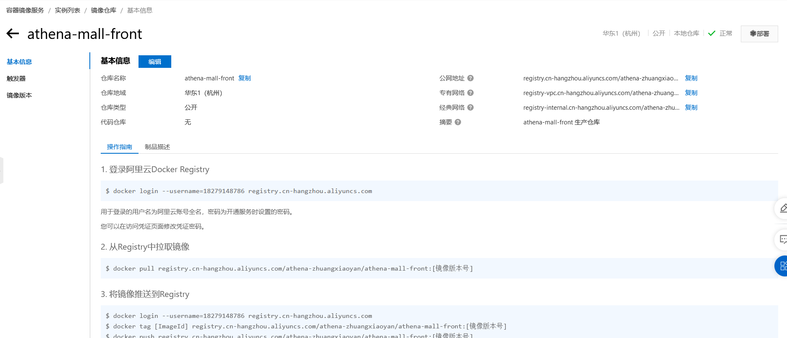
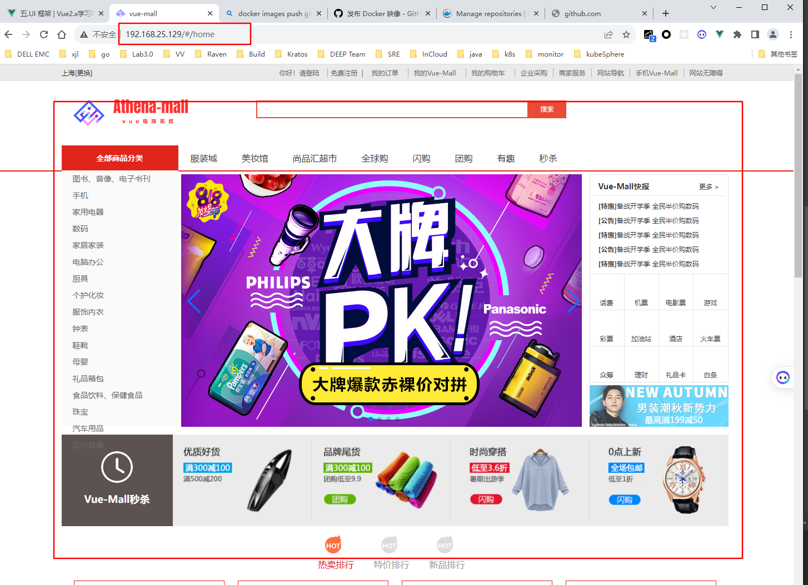

# <h1 align="center">《vue-mall的部署与访问》</h1>

# Vue部署在docker容器中

## 安装Docker 

```shell
# 使用国内 daocloud 一键安装命令：
sudo curl -sSL https://get.daocloud.io/docker | sh
sudo groupadd docker #添加docker用户组
sudo gpasswd -a $USER docker #将登陆用户加入到docker用户组中
newgrp docker #更新用户组
```

```shell
# 安装docker
curl -fsSL https://get.docker.com | bash -s docker --mirror Aliyun
# 启动docker服务
systemctl start docker
# 设置docker开机自启
systemctl enable docker
# 配置docker加速器
mkdir -p /etc/docker
tee /etc/docker/daemon.json <<-'EOF'
{
  "log-driver": "json-file",
  "log-opts": {
    "max-size": "10m",
    "max-file": "3"
  }
}
EOF
# 重启docker服务
systemctl daemon-reload
systemctl restart docker
echo "Docker安装完成！"
```

## Dockerfile

```dockerfile
FROM node:14
COPY ./ /app
WORKDIR /app
RUN npm install && npm run build

FROM nginx
RUN mkdir /app
COPY --from=0 /app/dist /app
COPY nginx/nginx.conf /etc/nginx/nginx.conf
```

## .dockerignore

```text
**/node_modules
**/dist
```

## nginx.conf

```text
user  nginx;
worker_processes  1;

error_log  /var/log/nginx/error.log warn;
pid        /var/run/nginx.pid;

events {
  worker_connections  1024;
}

http {
  include       /etc/nginx/mime.types;
  default_type  application/octet-stream;
  log_format  main  '$remote_addr - $remote_user [$time_local] "$request" '
                    '$status $body_bytes_sent "$http_referer" '
                    '"$http_user_agent" "$http_x_forwarded_for"';
  access_log  /var/log/nginx/access.log  main;
  sendfile        on;
  keepalive_timeout  65;
  server {
    listen       80;
    server_name  localhost;
    location / {
      root   /app;
      index  index.html;
      try_files $uri $uri/ /index.html;
    }
    error_page   500 502 503 504  /50x.html;
    location = /50x.html {
      root   /usr/share/nginx/html;
    }
    # 配置代理，解决跨域问题
    location /api {
    	proxy_pass http://sph-h5-api.atguigu.cn/api;
    }
  }
}
```

## build images

```shell
docker build . -t vue-mall:1.0.0
```

## pull images
```shell
docker pull registry.cn-hangzhou.aliyuncs.com/athena-zhaungxiaoyan/athena-mall-product:
```



## run container

```shell
docker run --privileged=true --restart=always -nname==vue-mall -d -p 80:80  vue-mall:1.0.0 
```

## https ip

```shell
http://remote-ip/
```




# 博文参考

-[国外的虚拟电话](https://sms-activate.org/cn/)